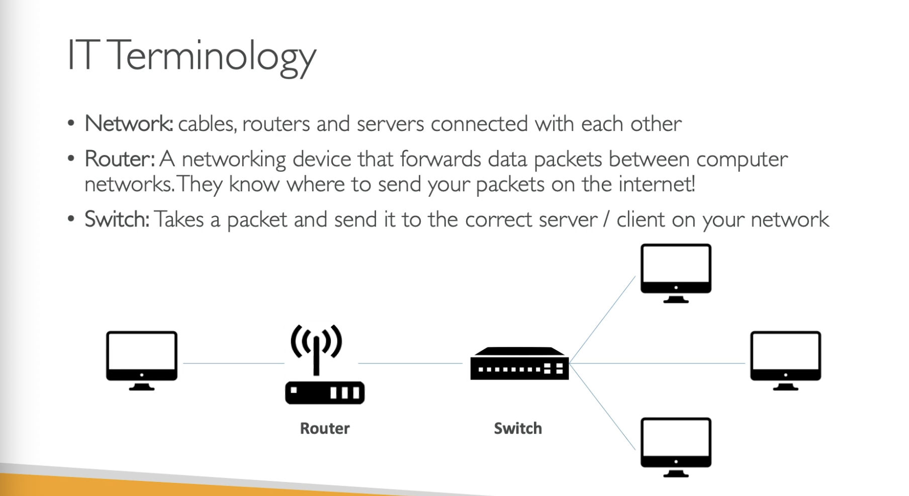

---

Cloud computing is the on-demand delivery of compute power, database, storage, applications, and other IT resources.

In cloud we use **pay-as-you-go** pricing

---

**The Deployment Models of the CLoud**

- Pivate Cloud;
- Public Cloud:
  - Azure;
  - GCP;
  - AWS;
- Hybrid Cloud;

---

**The 5 Characteristics of Cloud Computing**

- On-demand self service;
- Broad network access;
- Multi-tenancy and resource pooling;
- Rapid elasticity and scalability;
- Measured service;

---

**Problems solved by the Cloud**

- Flexibility;
- Cost-Effective;
- Scalability;
- Elasticity;
- High-availability and fault-tolerance;
- Agility;

---
