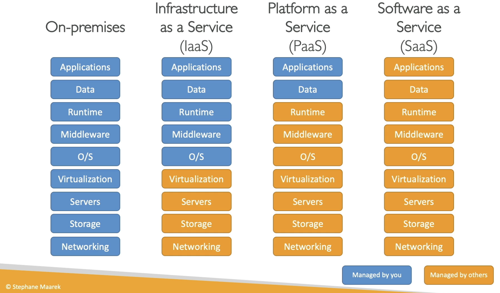

**Types of Cloud Computing**

- Infrastructure as a Service (IaaS);
- Platform as a Service (PaaS);
- Software as a Service (SaaS);

---

Examples:

- IaaS:
  - Amazon EC2;
- PaaS:
  - Elastic Beanstalk;
- SaaS:
  - Rekognition for ML tasks;

---
