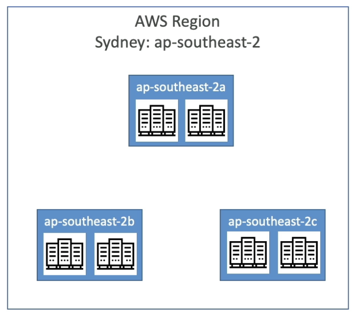

**Regions, zones, and points of presence**

---

AWS Regions

- AWS has regions all around the world;
- A region is a cluster of data centers;
- Most AWS services are region-scoped;

---

AWS Availability Zones

- Each region has many availability zones (min = 3, max = 6);
- Each availability zone (AZ) is one or more discrete data centers with redundant power, networking, and connectivity;
- They are separate from each other, so that ther are isolated from disasters;

---

AWS Points of Present (Edge Locations):

- Amazon has 400+ Points of Presence;

---
