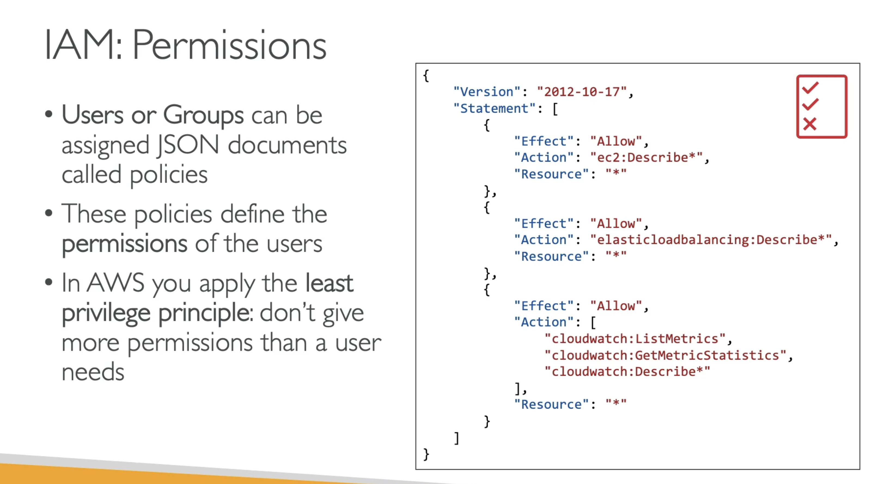

**IAM: Users & Groups**

- IAM = Identity and Access Management, **Global** service;
- **Root account** cretaed by default, should NOT be used or shared;
- **Users** are people within organization, and can be grouped;

More info:

- Groups only contain users, not other groups;
- Users don't have to belong to a group, and user can belong to multiple groups;

---

**Policies**

---

**Hierarchy of users**

- Root user
  - IAM user 1
  - IAM user 2
    ...
  - IAM user n

! The root user should NOT be used for day-to-day activities

---
