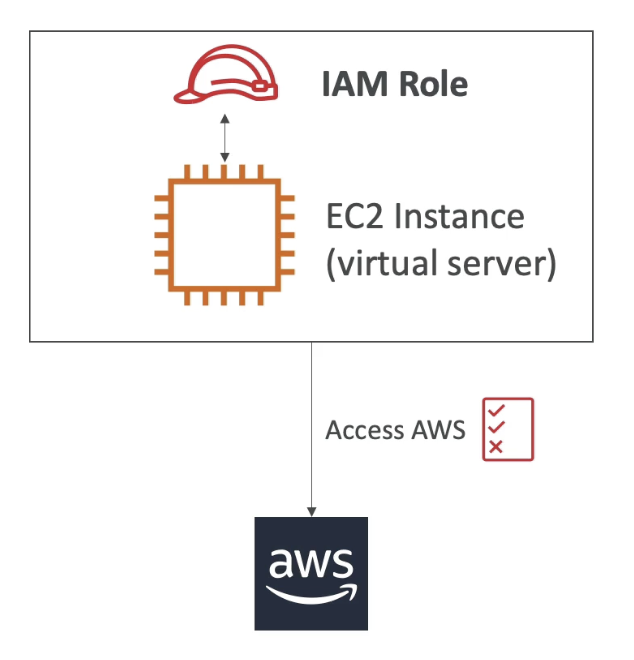
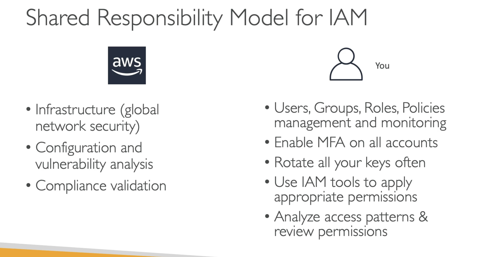

**IAM Roles for Services**

- Some AWS service will need to perform actions on your behalf;
- To do so, we will assign permissions to AWS services with IAM Roles;

---

Example:

---

**IAM Security Tools**

- IAM Credentials Report (account-level);
- IAM Access Advisor (user-level);

---

---
