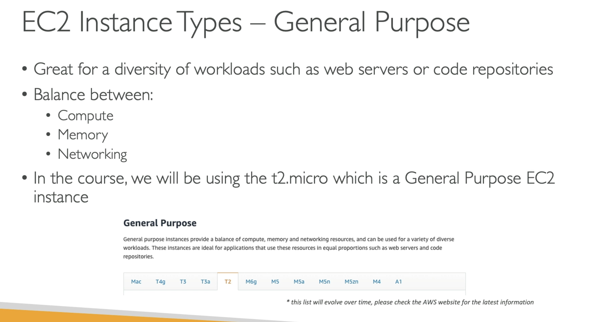
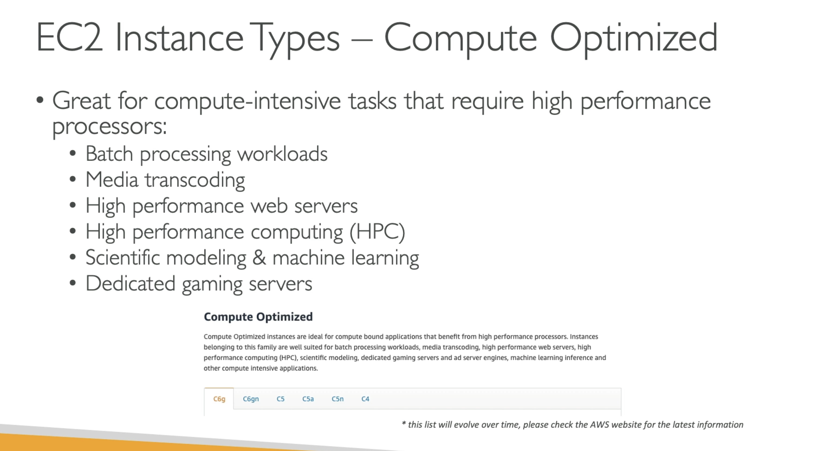
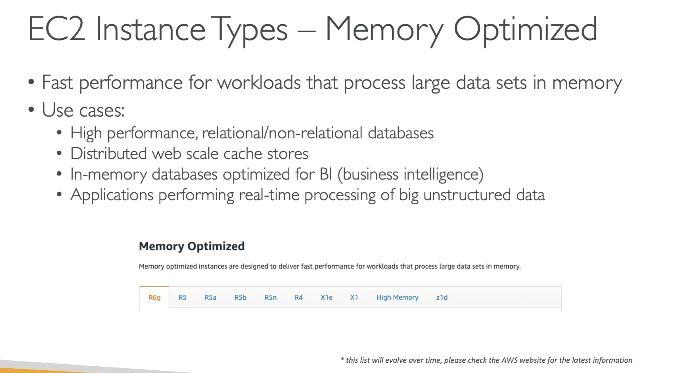
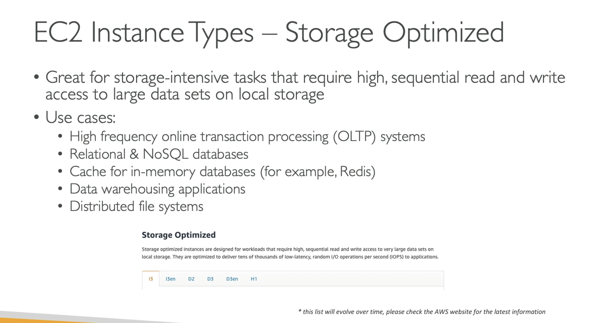
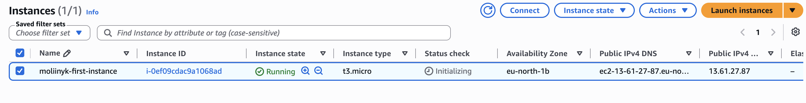

**Amazon EC2**

- EC2 = Elastic Compute Cloud = Infrastructure as a Service

---

**EC2 sizing & configuration options**

- Operating System (OS): Linux, Windows, or Mac OS;
- How much compute power & core (CPU);
- How much random-access memory (RAM);
- How much storage space:
  - EBS & EFS;
- Network card: speed of the card, Public IP address;
- Firewall rules;
- Bootstrap script;

---

**EC2 Instance Types**

- General purpose;

- Compute optimized;

- Memory optimized;

- Accelerated computing;
- Storage optimized;

- HPC optimized;

---

AWS has the following naming convention:
`m5.2xlarge`

- `m`: instance class;
- `5`: generation (AWS improves them over time);
- `2xlarge`: size within the instance class;

---

**Example of running EC2 instance**

---
