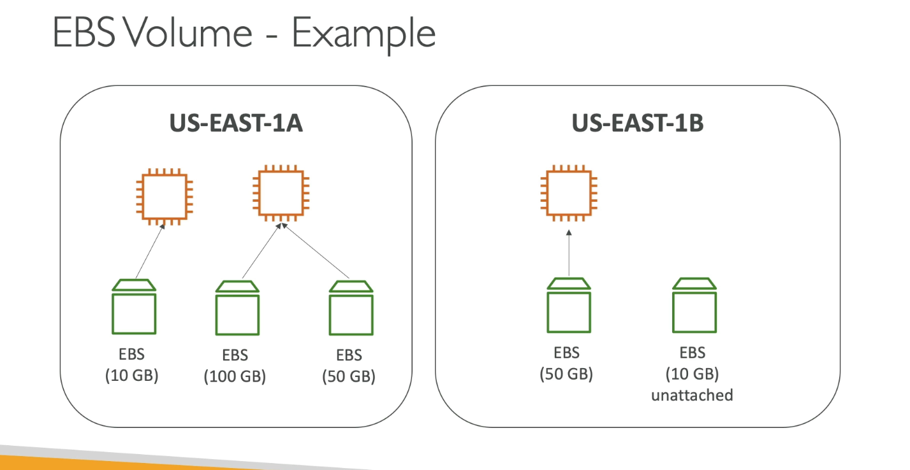
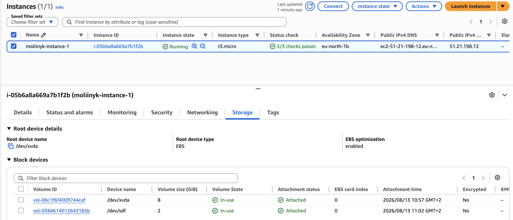

**EBS Volume**

- An EBS (Elastic Block Storage) Volume is a newtork drive you can attach to your instances while they run;
- It allows your instances to persist data, even after their termination;
- **!** They can only be mounted to one instance at a time (at the CCP level);
- They are bound to a specific availability zone;
- It'a a network drive;
- It's locked to an Availability Zone (AZ);
- Have a provisioned capacity (size in GBs, and IOPS);

EBS - Delete on Termination attribute:

- Controls the EBS behaviour when EC2 instance terminates
  - By default, the root EBS volume is deleted (attribute enabled);
  - By default, any other attached EBS volume is not deleted (attribute disabled);

---
