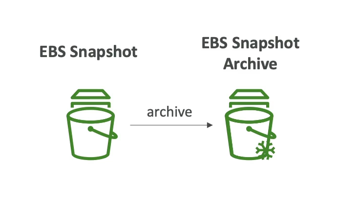
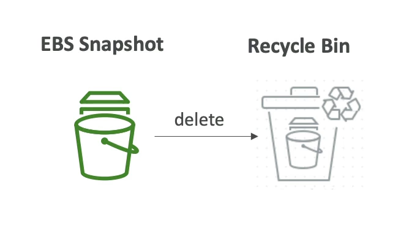

**EBS Snapshots**

- Make a backup (snapshot) of your EBS volume at a point in time;
- Not necessary to detach volume to do snapshot, but recommended;
- Can copy snapshots across AZ or Region;

Some features:

- EBS Snapshot Archive;

- Recycle Bin for EBS Snapshots;

---
