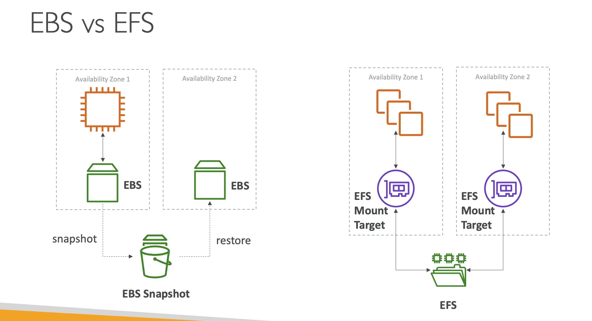

**EFS - Elastic File System**

- Managed NFS (network file system) that can be nounted on 100s of EC2;
- EFS works with Linux EC2 instances in multi-AZ;
- Highly available, scalable, expensive (3x gp2), pay per use, no capacity planning;

---

**EBS vs EFS**

---

**EFS Infrequent Access (EFS-IA)**

- Storage class that is cost-optimized for files not accessed every day;
- Up to 92% lower cost compared to EFS Standard;
- EFS will automatically move your files to EFS-IA based on the last time they were accessed;

---
