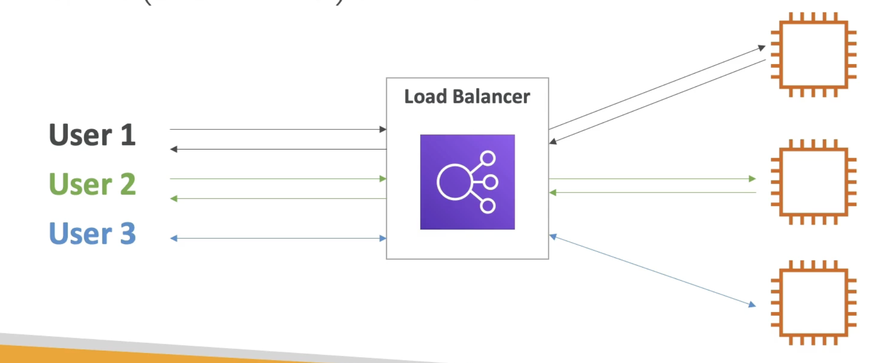
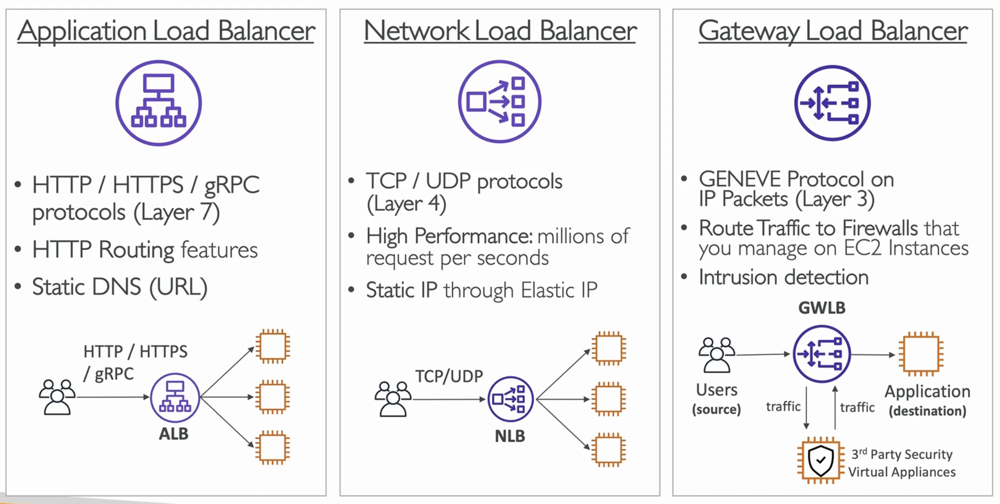

**Elastic Load Balancing (ELB)**

- Load balancers are servers that forward internet traffic to multiple servers (EC2 Instances) downstream;

---

**Why use an Elastic Load Balancer?**

- An ELB is a managed load balancer:
  - AWS guarantees that it will be working;
  - AWS takes care of updates, maintenance, high availability;
  - AWS provides only a few configuration knobs;
- It costs less to setup your own load balancer but it will be a lot more effort on your end (maintenance, integrations);
- 4 kinds of load balancers offered by AWS;
  - Application Load Balancer (HTTP / HTTPS only) - Layer 7;
  - Network Load Balancer (allows for TCP) - Layer 4;
  - Gateway Load Balancer - Layer 3;
  - Classic Load Balancer (retired in 2023) - Layer 4 & 7;

---
