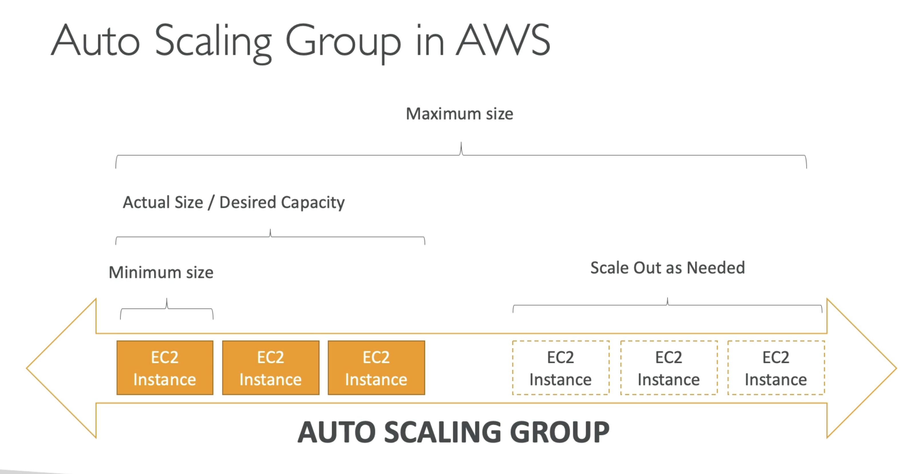

**Auto Scaling Group**

- The goal of an Auto Scaling Group (ASG) is to:
  - Scale out (add EC2 instances) to match an increased load;
  - Scale in (remove EC2 instances) to match a decreased load;
  - Ensure we have a minimum and a maximum number of machines running;
  - Automitically register new instances to a load balancer;
  - Replace unhealthy instances;
- Cost Savings: only run at an optimal capacity (principle of the cloud);

---

**!** Auto Scaling Group works _hand in hand_ with the Load Balancer

---
