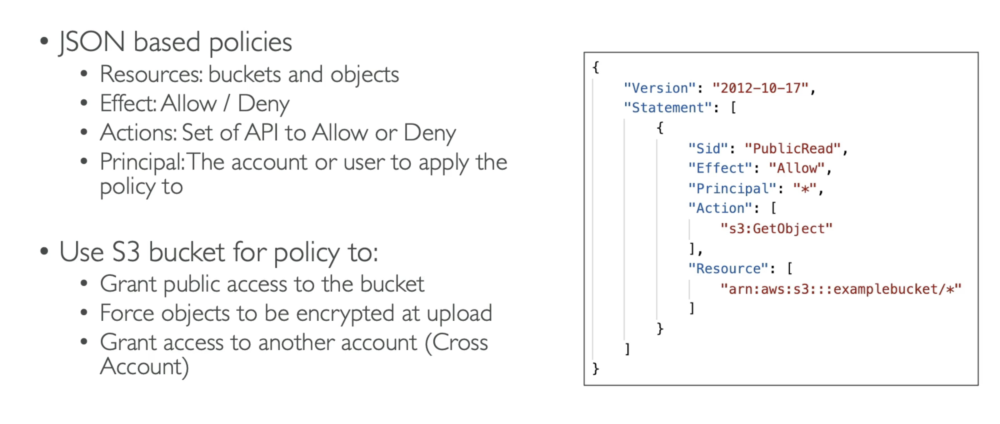

**Amazon S3 - Security**

- _User-Based_:
  - IAM Policies;
- _Resource-Based_:
  - Bucket Policies;
  - Object Access Control List (ACL);
  - Bucket Access Control List (ACL);

Also it is possible to encrypt objects in Amazon S3 using encryption keys;

---

**S3 Bucket Policies**



```json
{
  "Version": "2012-10-17",
  "Statement": [
    {
      "Sid": "Statement1",
      "Effect": "Allow",
      "Principal": "*",
      "Action": "s3:GetObject",
      "Resource": "arn:aws:s3:::moliinyk637-demo-s3-bucket/*"
    }
  ]
}
```

---
