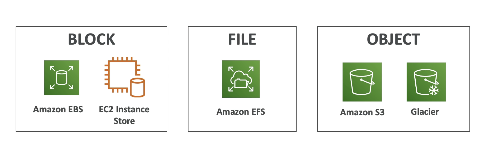

**AWS Storage Cloud Native Options**

---

**AWS Storage Gateway**

- _Bridge between on-premise data and cloud in S3_;
- Hybrid storage service to allow on-premises to seamlessly use the AWS Cloud;
- Use cases: disaster recovery, backups;

---

Types of Storage Gateway:

- File Gateway;
- Volume Gateway;
- Tape Gateway;

---
