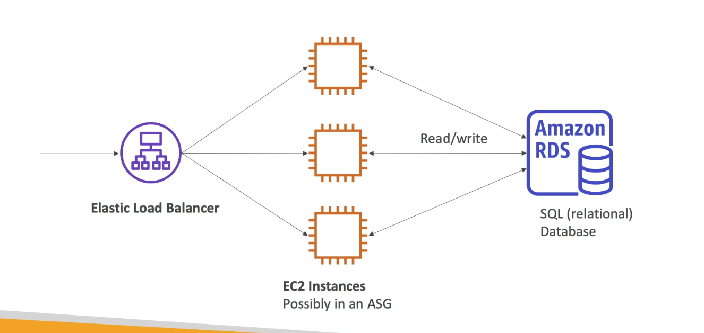

**RDS Overview**

- RDS stands for Relational Database Service;
- It's a managed DB service for DB use _SQL_ as a query language;
- It allows you to cretae databases in the cloud that are managed by AWS:
  - Postrges;
  - MySQl;
  - MariaDB;
  - Oracle;
  - Microsoft SQL Server;
  - IBM DB2;
  - **Aurora** (AWS Proprietary database);

---

**Amazon Aurora**

- Aurora is a proprietary technology from AWS (not open sourced);
- PostgreSQL and MySQL are both supported as Aurora DB;
- Aurora is "AWS cloud optimized" and claims 5x performance improvement over MySQL on RDS, over 3x the performance of PostgreSQL on RDS;
- Aurora storage automatically grows in increments of 10GB, up to 256 TB;

---

**Amazon Aurora Serverless**

- Automated database instantiation and auto-scaling based on actual usage;
- PostgreSQL and MySQL are both supported as Aurora Serverless DB;
- No capacity planning needed;
- Least management overhead;
- Pay per second, can be more cost-effective;
- Use cases: good for infrequent, intermittment or unpredictable workloads;

---
