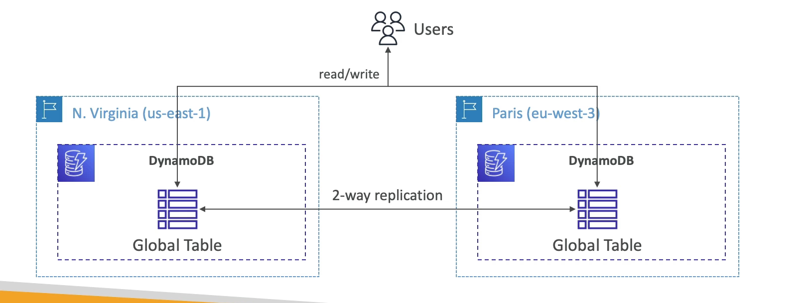

**DynamoDB**

- Fully Managed Highly available with replication across 3 AZ;
- **NoSQL database** - not a relational database;
- Scales to massive workloads, distributed "serverless" database;
- Millions of requests per seconds, trillions of row, 100s of TB of storage;
- Fast and consistent performance;
- Single-digit millisecond latency - low latency retrieval;
- Integrated with IAM for security, authorization, and administration;
- Low cost and auto scaling capabilities;
- Standard & Infrequent Access (IA) Table Class;

---

**DynamoDB Accelerator - DAX**

- Fully Managed in-memory cache for DynamoDB;
- `10x performance improvement` - single-digit millisecond latency to microseconds latency - when accessing your DynamoDB tables;
- Secure, highly scalable & highly available;
- Difference with ElastiCache at the CCP level: _DAX is only used and is integrated with DynamoDB_, while ElastiCache can be used for other databases;

---

**DynamoDB - Global Tables**

- Make a DynamoDB table accessible with _low latency_ in multiple-regions;
- _Active-Active_ replication (read/write to any AWS Region);

---
