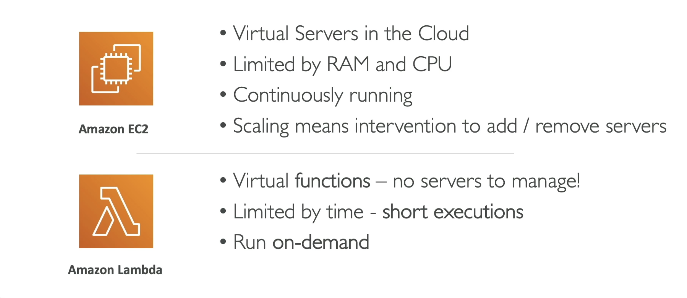
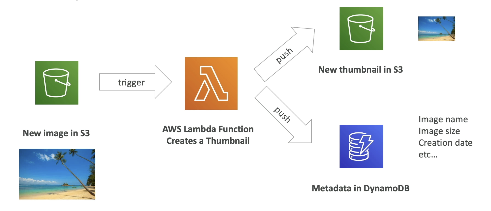
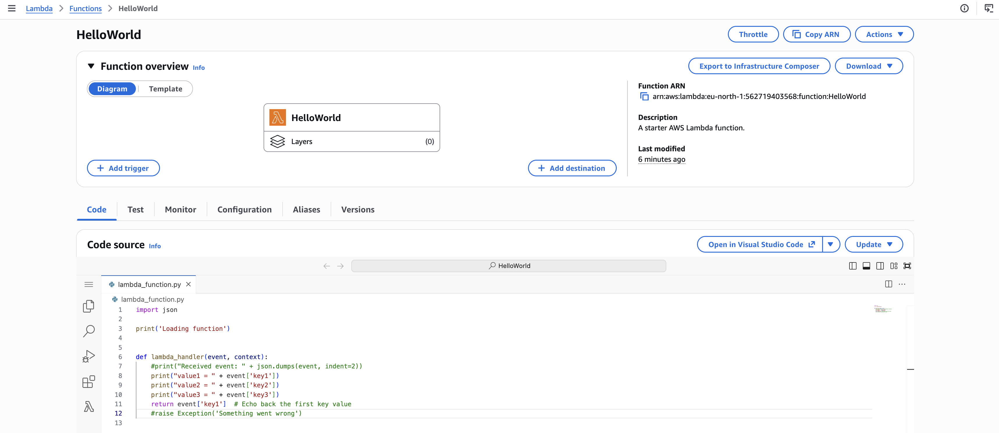
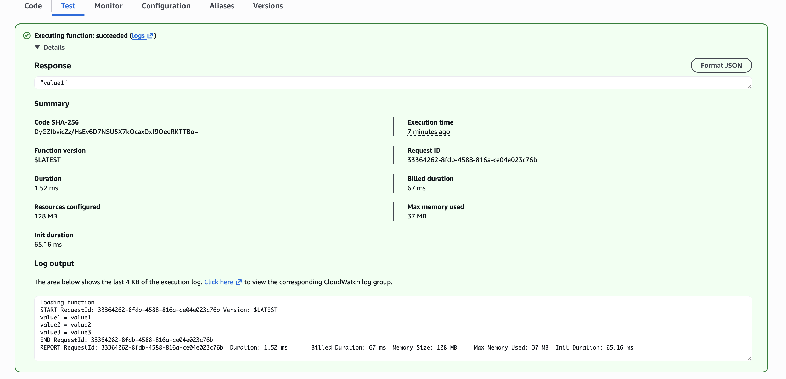

**Why AWS Lambda**

---

**Benefits of AWS Lambda**

- Easy Pricing:
  - Pay per request and compute time;
  - Free tier of 1000000 AWS Lambda requests and 400000 GBs of compute time;
- Integrated with the whole AWS suite of services;
- _Event-Driven_: functions get invoked by AWS when needed;
- Integrated with many programming languages;
- Easy monitoring through AWS CloudWatch;
- Easy to get more resources per functions (up to 10GB of RAM!);
- Increasing RAM will also improve CPU and network!;
- Lambda pricing is based on **calls** and **duration**;

---

**Generic example of usage**

---

**Real example of usage**

---
