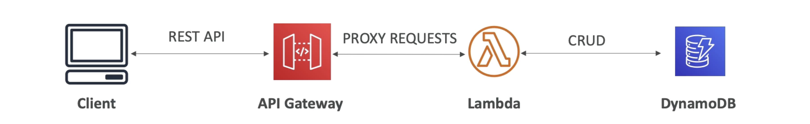

**Amazon API Gateway**

- Example: building a serverless API;

- Fully managed service for developers to easily create, publish, maintain, monitor, and secure APIs;
- Serverless and scalable;
- Supports RESTful APIs and WebSocket APIs;
- Support security, user authentication, etc;

---
