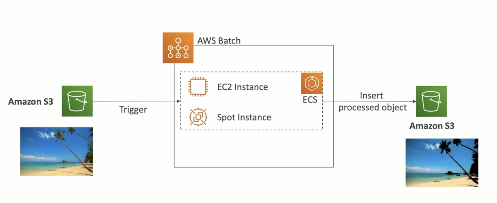
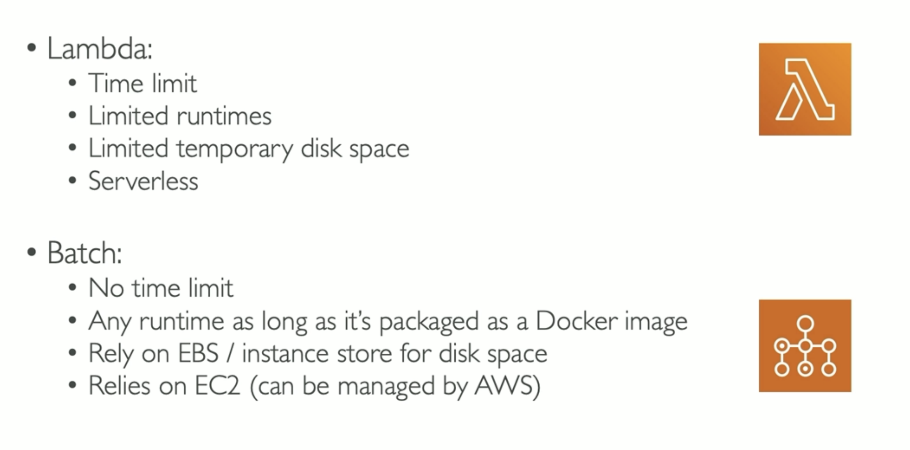

**AWS Batch**

- Fully managed batch processing at any scale;
- Efficiently run 100000s of computing batch jobs on AWS;
- Batch will dynamically launch EC2 instances or Spot Instances;
- Batch jobs are defined as _Docker images_ and _run on ECS, EKS, Fargate_;

---

**Batch vs Lambda**

---
