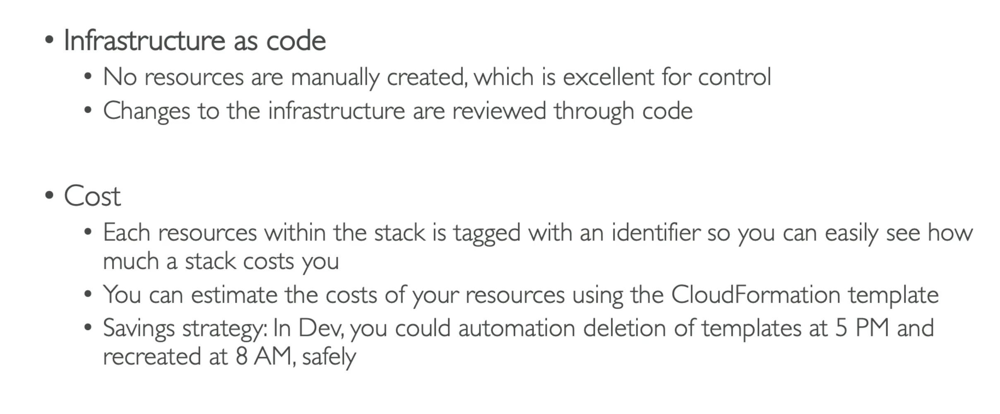
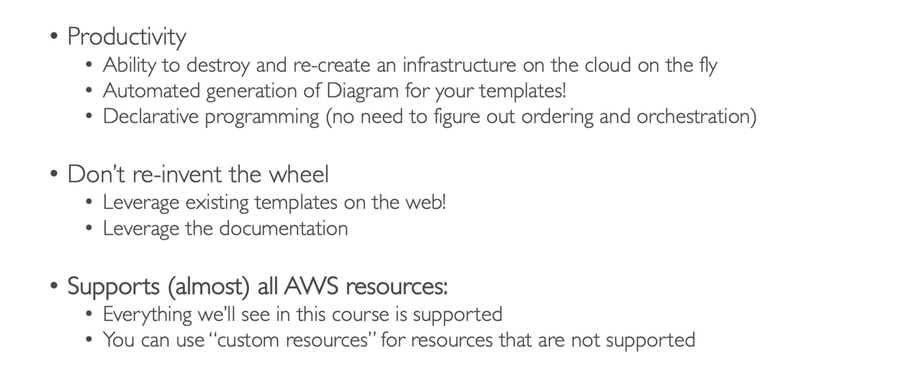

**CloudFormation**

- CloudFormation is a declarative way of outlining your AWS Infrastructure, for any resources (most of them are supported);
- CloudFormation creates resources for you, in the _right order_, with the _exact configuration_ that you specify;

---

**Benefits of AWS CloudFormation**

---
