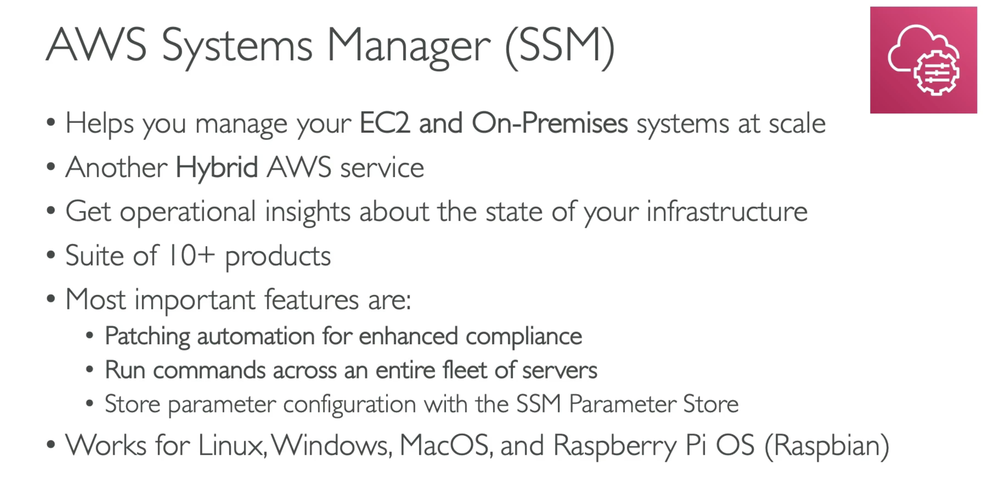

**AWS SMM**

---

**System Manager - SSM Session Manager**

- Allows you to start a secure shell on your EC2 and on-premises servers;
- No SSH access, bastion hosts, or SSH keys needed;
- No port 22 needed (better security);
- Send session log data to S3 or CloudWatch Logs;

---

**SMM Parameter Store**

- Secure storage for configuration and secrets;
- API Keys, passwords, configurations, ...;
- Serverless, scalable, durable, easy SDK;
- Control access permissions using IAM;
- Version tracking & encryption (optional);

---
