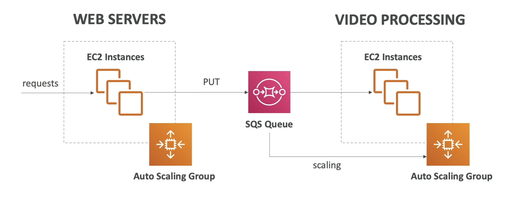

**Amazon SQS - Simple Queue Service**

(It uses `pull-based` system)

**Amazon SQS - Standard Queue**

- Oldest AWS offering (over 10 years old);
- Fully managed service (~serverless), use to _decouple_ applications;
- Scales from 1 message per second to 10000 per second;
- Default retention of messages: 4 days, maximum of 14 days;
- No limit to how many messages can be in the queue;
- Messages are deleted after they're read by consumers;
- Low latency (< 10 ms on publish and recieve);
- Consumers share the work to read messages & scale horizontally;

---

**SQS to decounple between application tiers**

---

**Amazon SQS - FIFO Queue**

- FIFO = First In First Out (ordering of messages in the queue);
- Messages are processed in order by the consumer;

---
