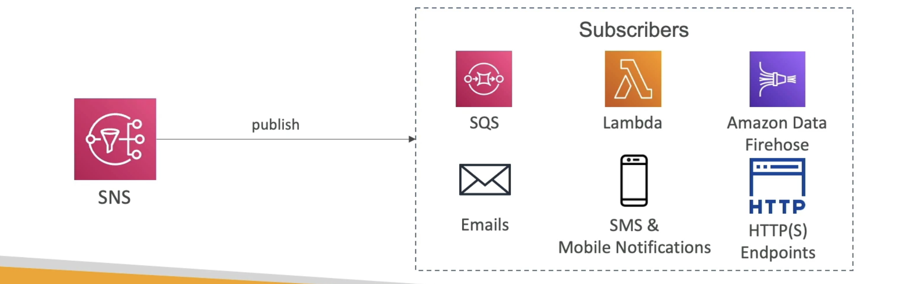

**Amazon SNS**

- SNS = Simple Notification Service;
- The "event **publishers**" only sends message to one SNS topic;
- As many "event **subscribers**" as we want to listen to the SNS topic notifications;
- Each subscriber to the topic _will get all the messages_;
- Up to 12500000 subscriptions per topic, 100000 topics limit;

---
