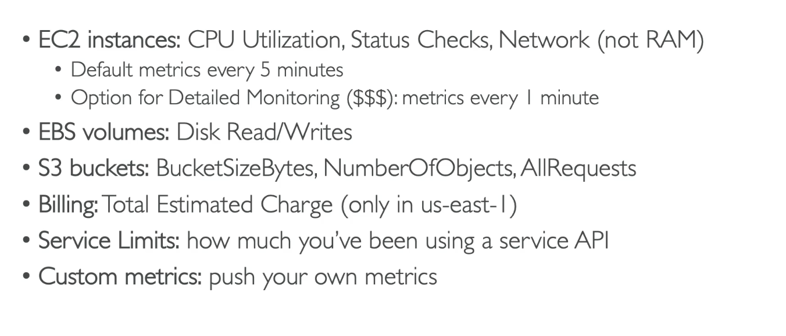
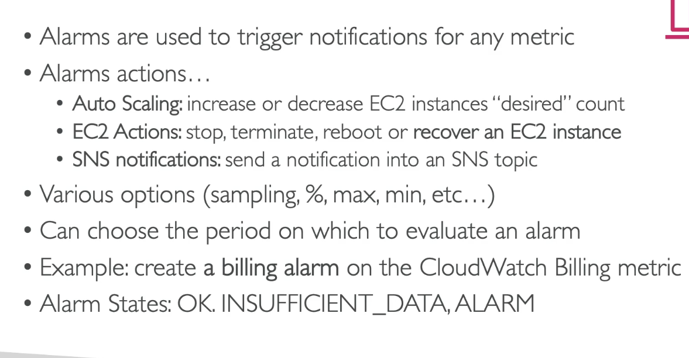

**Amazon CloudWatch Metrics**

- CloudWatch provides metric for every services in AWS;
- _Metric_ is a variable to monitor (CPUUtilization, NetworkIn, ...);
- Metrics have timestamps;
- Can create _CloudWatch dashboards_ of metrics;

---

**Amazon CloudWatch Alarms**

---
