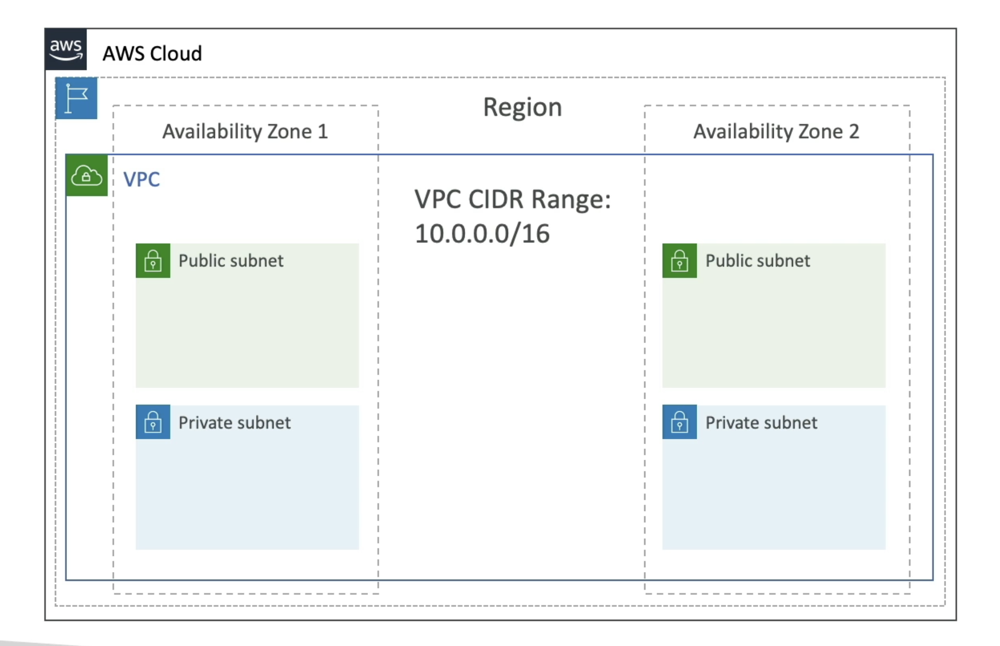

**VPC & Subnets Primer**

- VPC - Virtual Private Cloud: private network to deploy your resources (regional resource);
- Subnets: allow you to partition your network inside your VPC (Availability Zone resource);
- A _public subnet_ is a subnet that is accessible from the internet;
- A _private subnet_ is a subnet that is not accessible from the internet;
- To define access to the internet and between subnets, we use **Route Tables**;

---

**Internet Gateway & NAT Gateways**

- Internet Gateways help our VPC instances connect with the internet;
- Public Subnets have a route to the internet gateway;
- NAT Gateways (AWS-managed) & NAT Instances (self-managed) allow your instances in your _Private Subnets_ to access the internet while remaining private;

---
