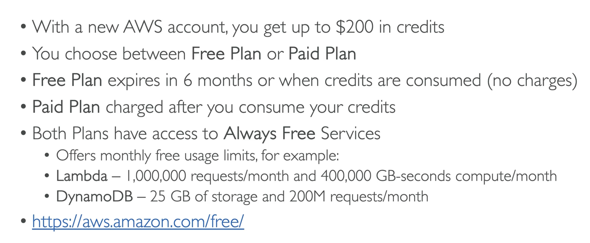
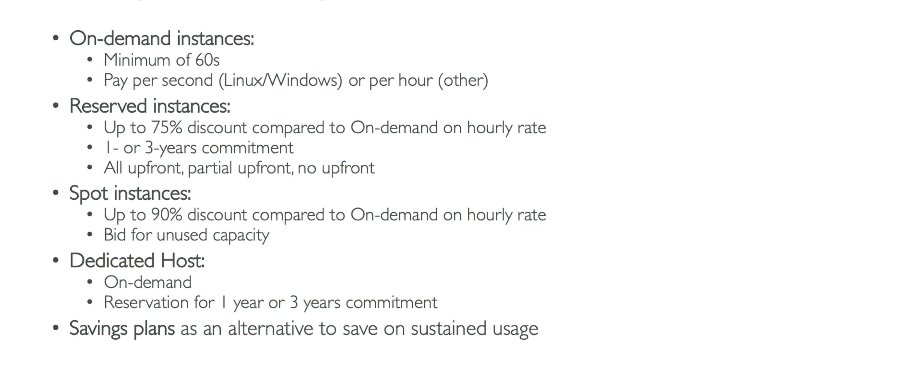
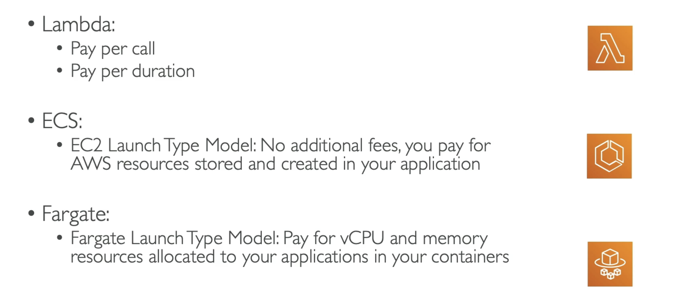
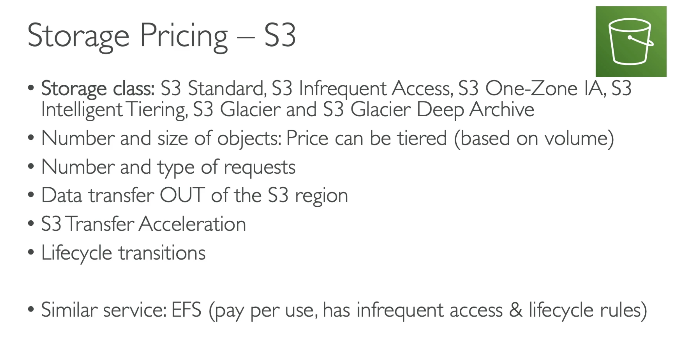
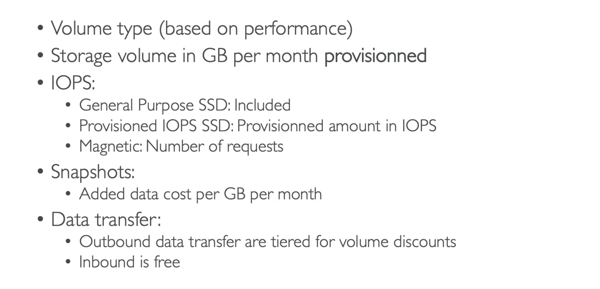
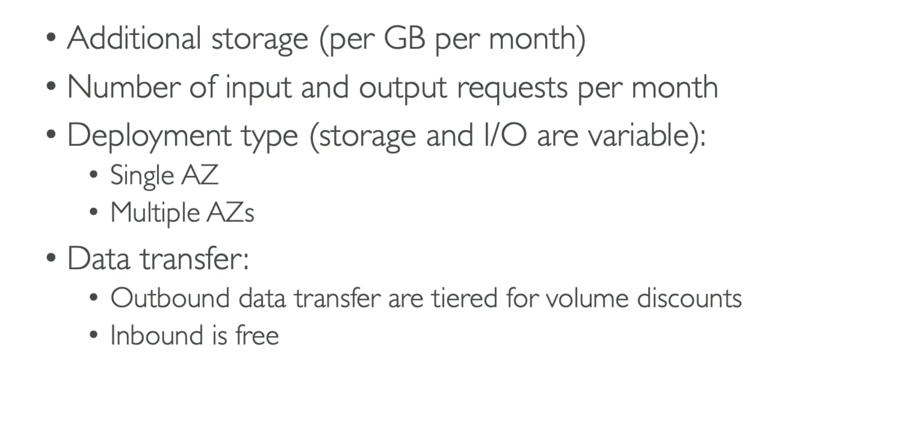
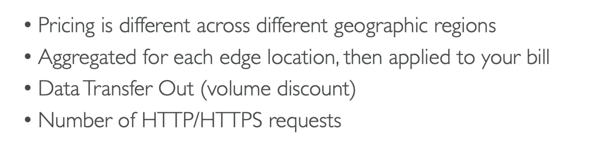
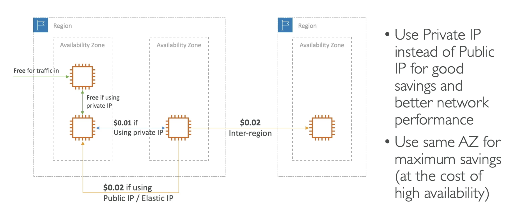

**Pricing Models in AWS**

- AWS has 4 pricing models:
  - _Pay as you go_: pay for what you use, remain agile, responsive, meet scale demands;
  - _Save when you reserve_: minimize risks, predictably manage budgets, comply with long-terms requirements;
  - _Pay less by using more_: volume-based discounts;
  - _Pay less as AWS grows_;

---

**Free Services & Free Plan in AWS**

---

**Compute Pricing - EC2**

---

**Compute Pricing - Lambda & ECS**

---

**Storage Pricing - S3**

---

**Storage Pricing - EBS**

---

**Database Pricing - RDS**

---

**Content Delivery - CloudFront**

---

**Networking Costs in AWS per GB - Simplified**

---
