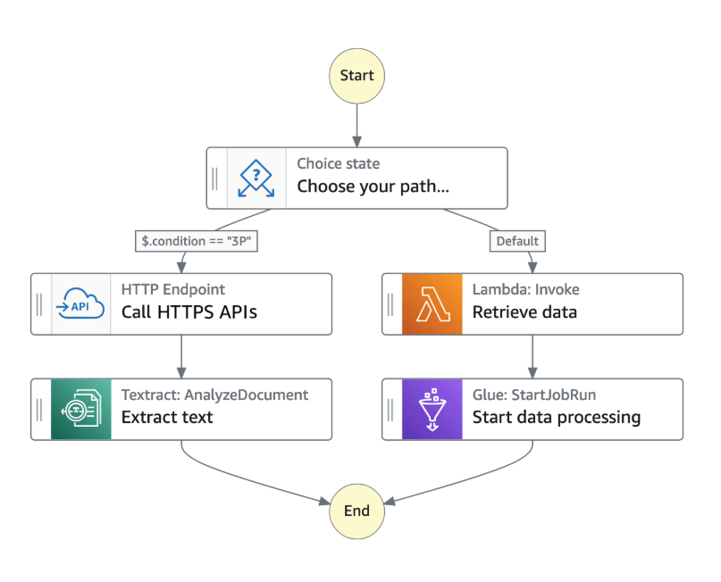

**AWS Step Functions**

- Build serverless visual workflows to orchestrate your Lambda functions;
- _Features:_ sequence, parallel, conditions, timeouts, error handling, ...;
- Can integrate with EC2, ECS, On-premises servers, API Gateway, SQS queues, etc ...;
- Possibility of implementing human approval feature;
- _Use cases:_ order fulfillment, data processing, web applications, any workflow;

---
